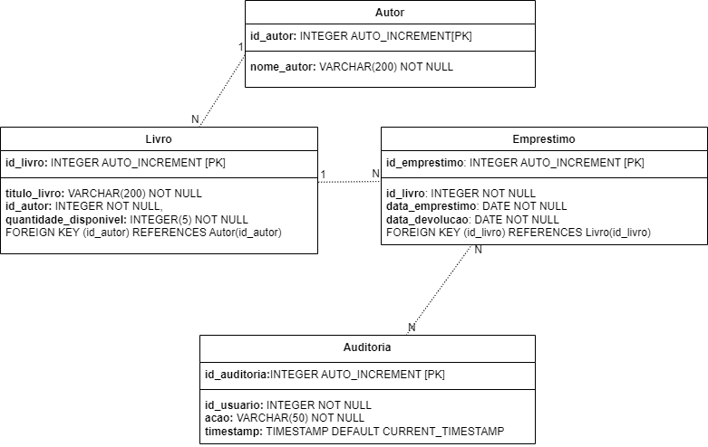

# Biblioteca 📚
Este projeto é uma aplicação simples de gerenciamento de uma biblioteca. Ele realiza a conexão com um banco de dados MySQL para armazenar informações sobre autores, livros, empréstimos e auditoria. A aplicação permite ao usuário cadastrar autores, livros, realizar empréstimos, devolver livros e visualizar todas as informações armazenadas no banco de dados.

# Configuração do Banco de Dados
O projeto utiliza um banco de dados MySQL para armazenar as informações. Certifique-se de ter um servidor MySQL em execução e atualize as configurações de conexão no arquivo DatabaseConnector.java localizado em src/main/java/br/ucb/bd/database.

// DatabaseConnector.java

 // Public class DatabaseConnector {
    // Configurações do banco de dados
    private static final String URL = "jdbc:mysql://localhost:3306/seu_banco_de_dados";
    private static final String USUARIO = "seu_usuario";
    private static final String SENHA = "sua_senha";
    
 } 
Substitua "seu_banco_de_dados", "seu_usuario" e "sua_senha" pelos valores adequados do seu ambiente.

# Funcionalidades da Aplicação
A aplicação oferece as seguintes funcionalidades:

Cadastrar Autor:

Permite ao usuário cadastrar um novo autor.
Cadastrar Livro:

Permite ao usuário cadastrar um novo livro, associando-o a um autor existente.
Realizar Empréstimo:

Permite ao usuário realizar o empréstimo de um livro.
Devolução de Livro:

Permite ao usuário registrar a devolução de um livro.
Exibir Tudo do Banco de Dados:

Apresenta ao usuário uma visão completa de todos os autores, livros, empréstimos e auditoria armazenados no banco de dados.
# MER

# Executando a Aplicação
Certifique-se de ter o Java e o Maven instalados no seu sistema.
Configure as informações de conexão com o banco de dados no arquivo DatabaseConnector.java.
Execute o comando Maven para compilar e construir o projeto:
mvn clean install
Execute a classe App para iniciar a aplicação.
